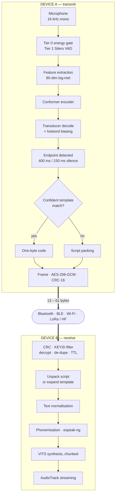

<div align="center">

<picture>
  <source media="(prefers-color-scheme: dark)" srcset="docs/assets/sih-2026-dark.png">
  
</picture>

<br><br>

# iTantra

**Indian Multilingual TTS &amp; STT Aided Neural Transceiver**<br>
*Radio Access for Low Bitrate Links*

Smart India Hackathon 2026 · Problem Statement **26173** · ISRO, Department of Space

<br>


<br>


</div>

<br>

> **Speech goes in one end. Speech comes out the other.** In between it becomes a few dozen
> bytes — small enough to cross a radio link that could never carry a voice.

Two people hold two ordinary phones. One speaks Tamil; the other hears Tamil. There is no
SIM, no tower, no cloud, and no network call of any kind — the demonstration runs with
aeroplane mode visibly enabled. What passes between them is not audio. It is meaning, and
meaning is small.

**Contents** ·
[The idea](#the-idea-in-one-table) ·
[How it works](#how-a-sentence-crosses-the-link) ·
[Compression](#three-levels-of-compression) ·
[Cross-language](#cross-language-delivery-is-a-side-effect) ·
[On the wire](#what-is-actually-on-the-wire) ·
[One net](#many-units-on-one-net) ·
[Security](#encryption-is-the-real-address) ·
[Languages](#ten-languages) ·
[Transports](#four-transports-one-interface) ·
[Status](#status) ·
[Build](#build-it) ·
[Docs](#documentation)

---

## The idea in one table

| Representation | Size for a 3-second sentence | Fits a 300 bps link? |
| --- | --- | --- |
| Raw PCM, 16 kHz 16-bit mono | 96 000 B | No — 43 minutes |
| Opus at 6 kbps (the practical floor) | 2 250 B | No — 60 s |
| Plain UTF-8 sentence, unauthenticated | 111 B | Yes — 3.0 s |
| **iTantra packed text, authenticated** | **52 B** | **Yes — 1.4 s** |
| iTantra packed text, unauthenticated | 44 B | Yes — 1.2 s |
| **iTantra template code, authenticated** | **21 B** | **Yes — 0.6 s** |
| iTantra template code, unauthenticated | 13 B | Yes — 0.3 s |

Audio codecs compress the *waveform*, and a waveform detailed enough to be understood has
an irreducible size. iTantra does not compress the waveform at all. It recognises the
speech on the sending device, transmits the meaning, and re-synthesises the speech on the
receiving device. The two humans only ever speak and listen — neither reads nor types.

> **Which number to quote.** The headline figure is often given as 44 B, but that frame is
> unauthenticated. In any deployment worth defending the payload is sealed, and the honest
> figure is **52 B** on a low-rate link or 60 B on Bluetooth. Against raw PCM that is still
> **1 600×**, and against the Opus floor **43×**. Both numbers are defensible; only one of
> them survives a question from a technical jury, so this project quotes the authenticated
> one. See [PROTOCOL.md §1](docs/PROTOCOL.md).

---

## How a sentence crosses the link

Both halves live on every device and both are always resident. The transmit path is gated
by mode and by the push-to-talk key; the receive path is always armed.



The expensive parts — recognition and synthesis — happen at the two ends, where there is a
CPU and a battery. The link in the middle carries almost nothing, which is precisely why it
can be a link that carries almost nothing.

---

## Three levels of compression

Each level is a fallback for the one above it. The system chooses automatically and the
user is never aware of the switch.

### Level 1 — recognise the speech at all

Turning a 3-second utterance into its text is where the ~770× comes from. Everything
after this is refinement.

### Level 2 — script packing

UTF-8 spends three bytes per character on every Indic script, because UTF-8 must be able to
represent all scripts at once. But the frame header already declares the language, so the
receiver knows which 128-codepoint Unicode block applies. Subtract the block base and each
character becomes a single byte.

| Byte range | Meaning |
| --- | --- |
| `0x00`–`0x1A`, `0x1C`–`0x7F` | Literal ASCII — space, digits, punctuation, embedded Latin |
| `0x1B` | **Escape.** The next three bytes are a 24-bit Unicode scalar |
| `0x80`–`0xFF` | Codepoint `blockBase + (byte − 0x80)` — the whole 128-codepoint block |

The escape is mandatory, not decorative: real operational messages contain Latin digits,
punctuation, callsigns and unit symbols. `0x1B` is safe as the marker because it is never
valid running text.

**Worked example** — `हमें तुरंत मदद चाहिए`, 20 characters:

| Encoding | Size |
| --- | --- |
| UTF-8 | 54 B — 18 Devanagari × 3, plus 2 spaces |
| Packed | **20 B** — 18 in `0x80`–`0xFF`, 2 spaces as `0x20` |

2.7× over UTF-8, on top of the ~770× already achieved by recognising the speech.

The transformation is lossless, table-driven, costs microseconds, and is available only
because we control both endpoints.

### Level 3 — template codes

In an emergency, vocabulary is small and predictable. A shared table maps common
operational sentences to single-byte identifiers:

```
0x01  We need medical assistance
0x02  Fire — evacuate immediately
0x03  Position secure, no casualties
0x04  Send a boat
0x05  Request immediate extraction
...   up to 255 entries per deployment profile
```

After recognition the text is fuzzy-matched against the table. On a confident match the
system sends a one-byte payload. On a weak match it falls back to Level 2 automatically.

---

## Cross-language delivery is a side effect

Every device holds the template table in all ten languages. A template-coded message
therefore renders in whichever language the *receiver* has selected.

**A Hindi speaker's alert reaches a Tamil speaker in Tamil** — with no translation model,
no additional download, and no additional latency. Cross-language operation is not a
feature that was added; it falls out of the compression scheme.

> This works **only** for template-coded traffic. Free-form text is delivered in the
> language it was spoken in. Saying so plainly matters: overclaiming it as general
> translation invites a question that has no good answer.

---

## What is actually on the wire

A 10-byte header, the payload, and a 2-byte CRC trailer.

```
 byte   0      1      2   3      4      5   6      7      8      9     10 …     n-2 n-1
      ┌──────┬──────┬──────────┬──────┬──────────┬──────┬──────┬──────┬───────┬─────────┐
      │MAGIC │ TYPE │   SEQ    │FLAGS │   LEN    │ SRC  │KEYID │ TTL  │PAYLOAD│  CRC16  │
      │ VER  │ LANG │          │      │          │      │      │      │       │         │
      └──────┴──────┴──────────┴──────┴──────────┴──────┴──────┴──────┴───────┴─────────┘
        └────────────────── header, 10 bytes ──────────────────┘        └─ trailer, 2 ─┘
```

| Field | B | Purpose |
| --- | --- | --- |
| `MAGIC`/`VER` | 1 | High nibble `0xA` — a sentinel for resynchronising a corrupted byte stream. Low nibble is the protocol version |
| `TYPE`/`LANG` | 1 | Message type, and the language index 0–9 that selects the packing table |
| `SEQ` | 2 | Per-sender sequence. Drives acknowledgement, duplicate suppression and the replay window |
| `FLAGS` | 1 | Payload *encoding* — `PACKED` or `TEMPLATE`, never both |
| `LEN` | 2 | Payload length, ≤ 1024. The basis of stream framing |
| `SRC` | 1 | Sender node. **There is no destination field** — see below |
| `KEYID` | 1 | First byte of SHA-256 of the shared key. A cheap reject filter, *not* a security control |
| `TTL` | 1 | Remaining relay hops, decremented on forward. Default 3 |
| `CRC16` | 2 | CRC-16/CCITT-FALSE over header and payload as transmitted, ciphertext included |

`TYPE` says how a frame is *handled*; `FLAGS` says how the payload is *encoded*. Keeping
them independent is what makes a template-coded **alert** expressible.

| Code | Type | Semantics |
| --- | --- | --- |
| `0x1` | `TEXT` | Recognised speech, packed or plain. Fire and forget |
| `0x2` | `ALERT` | Priority. Pre-empts the queue, acknowledged and retried, announced on the alarm stream |
| `0x3` | `ACK` | Acknowledges a sequence number |
| `0x4` | `PTT_CTL` | Floor seize and release; drives the channel-busy indicator |
| `0x5` | `HEARTBEAT` | Liveness, every 2 s. Also carries `EPOCH` |
| `0x6` | `TEMPLATE` | Single-byte identifier from the shared table |
| `0x7` | `POSITION` | Eight-byte packed latitude and longitude |
| `0x8` | `AUDIO_FB` | Opus fallback below confidence threshold. Wi-Fi only; refused on BLE and serial |

The CRC is an integrity check against corruption, **not** a security control. It is
verified even on authenticated payloads, because it lets a corrupt frame be dropped before
the more expensive AEAD verification and before any relay decision.

---

## Many units on one net

**There is no destination field.** Every frame is broadcast to every unit holding the key,
exactly as a walkie-talkie is. That is a deliberate choice, not an omission — and it is
what the animation above is showing.

- **Broadcast by default.** One transmission serves the whole net. A 52-byte packet is
  small enough to send to everyone.
- **Relaying.** A handset that hears a frame forwards it if `TTL` permits, decrementing on
  each hop. A unit out of range of the speaker is still reached through a unit that is not.
  `ACK` and `HEARTBEAT` are never relayed; `ALERT` always is, TTL permitting.
- **Floor control.** `PTT_CTL` seizes and releases the channel, so two units cannot talk
  over each other, and every unit shows a channel-busy indicator.
- **Duplicate suppression.** `SEQ` per sender means a frame arriving twice by two different
  relay paths is spoken once.

---

## Encryption is the real address

Address filtering is a convention, not a control — any device can set any destination byte.
In a system whose purpose is to raise alarms, the ability to inject a fraudulent
maximum-volume evacuation order is a weapon.

| | |
| --- | --- |
| **AEAD** | AES-256-GCM |
| **Key** | 256-bit pre-shared, generated by the first unit, distributed by QR at provisioning, held in Android Keystore — never in DataStore, a file, or a log |
| **Associated data** | The **entire 10-byte header**, so `SRC`, `SEQ`, `TYPE` and `FLAGS` are all bound into the tag. The sender identity is authenticated, which is what defeats impersonation |
| **Nonce** | **Derived, not transmitted** — `EPOCH ‖ SRC ‖ SEQ ‖ 0x00×5`. Costs zero bytes on the wire |

`EPOCH` is a persisted per-sender counter, incremented whenever `SEQ` wraps and on every
service start, and carried in `HEARTBEAT` so a restarting receiver relearns it without a
handshake. This guarantees a `(key, nonce)` pair is never reused — the one failure mode
that destroys GCM entirely.

**Tag length is chosen by transport**, because on a 300 bps link eight bytes is 27 seconds
of airtime:

| Transport class | Tag | Rationale |
| --- | --- | --- |
| Bluetooth Classic, BLE, Wi-Fi | 16 B | Bytes are free; use the full tag |
| Serial to LoRa or HF | 8 B | 8 bytes saved is 27 s of airtime per message |

A truncated 64-bit tag is sound only while forgery attempts are bounded, so on low-rate
transports more than **16 failed verifications from one sender within 60 s** puts the link
into `DEGRADED` and raises a warning. Without that limit, truncation is not defensible.

Full threat model, provisioning flow and the pre-submission audit — including the two
findings that remain open and why — are in [docs/SECURITY.md](docs/SECURITY.md).

---

## Ten languages

Normative and fixed; changing this table is a protocol version change.

| Idx | Language | Script | Block base | | Idx | Language | Script | Block base |
| --- | --- | --- | --- | --- | --- | --- | --- | --- |
| 0 | English | Latin | — ASCII | | 5 | Tamil | Tamil | `U+0B80` |
| 1 | हिन्दी Hindi | Devanagari | `U+0900` | | 6 | ગુજરાતી Gujarati | Gujarati | `U+0A80` |
| 2 | বাংলা Bengali | Bengali | `U+0980` | | 7 | ಕನ್ನಡ Kannada | Kannada | `U+0C80` |
| 3 | मराठी Marathi | Devanagari | `U+0900` | | 8 | മലയാളം Malayalam | Malayalam | `U+0D00` |
| 4 | తెలుగు Telugu | Telugu | `U+0C00` | | 9 | ଓଡ଼ିଆ Odia | Odia | `U+0B00` |

Each Indic block spans exactly 128 codepoints. Hindi and Marathi share Devanagari and so
share a packing table, but remain distinct indices because they select different acoustic
models, voices and normalisation rules.

---

## Four transports, one interface

| Property | BT Classic | BLE | Wi-Fi | LoRa serial |
| --- | --- | --- | --- | --- |
| Range | 10–30 m | 10–50 m | 50–150 m | **2–15 km** |
| Usable rate | ~200 kbps | 5–20 kbps | > 10 Mbps | 0.3–5 kbps |
| Power | Medium | **Very low** | High | Low |
| Model | Byte stream | Packets | Byte stream | Packets |
| Native broadcast | No | Yes | Multicast | Yes |
| Fragmentation needed | No | Yes | No | Yes |
| **Role** | **Default** | **Standby** | **Range and fallback** | **Deployment** |

RFCOMM and TCP preserve byte order but not message boundaries, so every stream
implementation uses the same normative `readFully` loop and resynchronisation rule.

---

## Status

The end-to-end loop is closed and running on real handsets — speech in, radio link, speech
out — and the application has been exercised on a physical device rather than only in
tests.

| | |
| --- | --- |
| Tasks complete | **126 of 170** ([docs/TODO.md](docs/TODO.md)) |
| Source files | 156 across 8 modules |
| Test files | 76 |
| Last verified on | Galaxy **SM-S947B**, Android 16 |

The governing scheduling rule, from [docs/ROADMAP.md](docs/ROADMAP.md):

> The end-to-end loop closes in **week 3** using the weakest acceptable models. Model
> quality is an upgrade path, never a prerequisite. A working loop with mediocre models can
> be improved under any amount of time pressure; excellent models with no loop cannot be
> demonstrated at all.

### Targets

Measured on the entry-tier target handset after a thirty-minute thermal soak. Method and
full breakdown in [docs/EVALUATION.md](docs/EVALUATION.md).

| | Target |
| --- | --- |
| End-to-end latency, PTT mode | 800–1200 ms |
| End-to-end latency, phone mode | 1050–1500 ms |
| Word error rate, clean read speech | < 12 % |
| Word error rate, critical vocabulary with biasing | < 6 % |
| Installer size | < 30 MB (models fetched once at setup) |
| Idle CPU while listening | < 2 % |
| Standby endurance, BLE, screen off | > 8 h |

---

## Build it

Requires JDK 17+ (Gradle provisions it), the Android SDK, and Python 3 for the model
fetcher. Full environment notes in [docs/SETUP.md](docs/SETUP.md).

```bash
git clone https://github.com/vikranthsai310/sih2026.git
cd sih2026

./gradlew :core-proto:test      # fast: pure JVM, no device, no models
./gradlew assembleDebug         # build the APK

python -m venv .venv            # model fetcher
python tools/fetch_models.py --lang hi,en     # two languages
python tools/fetch_models.py --lang all       # all ten

./gradlew installDebug
adb logcat -s iTantra:V
```

`core-proto` deliberately has no Android plugin — the frame codec, CRC, AEAD and script
packing are pure JVM and testable in seconds without a handset.

### The demonstration

Seven minutes, and the order is deliberate — see [docs/DEMO.md](docs/DEMO.md).

| # | Action | Question it answers |
| --- | --- | --- |
| 1 | Both handsets on the table, **aeroplane mode visibly enabled** | Is this really offline? Settled before any claim is made |
| 2 | Hold transmit, speak Tamil; the second handset speaks Tamil | Does the core loop work? |
| 3 | Show the live byte counter against the equivalent audio size | The compression figure, measured live rather than asserted |
| 4 | Point to the latency strip: STT, link, TTS, total | Instrumentation on screen, not on a slide |
| 5 | Lock the second handset, set it silent, send an alert — it wakes at full volume | Does the alert requirement work as specified? |
| 6 | Release push-to-talk; hold an ordinary conversation with no button | Does telephone mode work? |
| 7 | Switch the receiver to Hindi; send a Tamil template alert — it announces in Hindi | Cross-language operation, with no translation model |

---

## Documentation

The complete design argument lives in
[`docs/source/iTantra.html`](docs/source/iTantra.html) — read that first if you want to
know *why* the system is shaped this way. The `docs/` tree is the normative engineering
specification: what to build, to what tolerance, and how it is verified.

| | |
| --- | --- |
| [docs/README.md](docs/README.md) | Index of the whole documentation set |
| [docs/REQUIREMENTS.md](docs/REQUIREMENTS.md) | R1–R11, the four constraints, the traceability matrix |
| [docs/ARCHITECTURE.md](docs/ARCHITECTURE.md) | Modules, threads, lifecycle, signal path |
| [docs/PROTOCOL.md](docs/PROTOCOL.md) | Frame format, packing, template codes, AEAD, relaying |
| [docs/ASR.md](docs/ASR.md) · [docs/TTS.md](docs/TTS.md) | Recognition and synthesis, end to end |
| [docs/TRANSPORT.md](docs/TRANSPORT.md) | The `Link` interface and its four implementations |
| [docs/SECURITY.md](docs/SECURITY.md) | Threat model, controls, provisioning, audit |
| [docs/EVALUATION.md](docs/EVALUATION.md) | How every published number is measured |
| [docs/UX.md](docs/UX.md) · [docs/WIREFRAMES.md](docs/WIREFRAMES.md) | Interaction rules and all seventeen screens |
| [docs/iTantra Screens.html](docs/iTantra%20Screens.html) | The rendered UI — openable in any browser |
| [docs/DEMO.md](docs/DEMO.md) | The seven-minute sequence and its failure recovery |
| [docs/ROADMAP.md](docs/ROADMAP.md) | Eight weeks, with an acceptance gate per week |
| [docs/TODO.md](docs/TODO.md) | **Start here to build.** Every task with a testable done-condition |

## Repository layout

```
settings.gradle.kts       8 modules; core-proto deliberately has no Android plugin
build.gradle.kts          dependency rules enforced as build failures
gradle/libs.versions.toml every version pinned, no dynamic ranges

app/                      UI, push-to-talk, alerts, pairing, foreground service
core-audio/               capture, playback, ring buffers, alert audio policy
core-asr/                 VAD tiers, endpointing, recognition, biasing
core-tts/                 normalisation, phonemisation, chunked playout
core-link/                Link interface: RFCOMM, BLE, Wi-Fi, serial
core-proto/               PURE JVM -- frame codec, CRC, AEAD, script packing
core-models/              language pack manifest, verification, lifecycle
bench/                    WER, RTF, latency, resource, scorecard export

models/                   manifest.json tracked; binaries are not
tools/                    model export, licence audit, report build
docs/                     the specification -- see docs/README.md
docs/source/              the original design document and the SIH template
```

## Licence

Released under **Apache-2.0**. The principal dependency, [sherpa-onnx](https://github.com/k2-fsa/sherpa-onnx),
is Apache-2.0, and the acoustic models are AI4Bharat IndicConformer under permissive terms.

Two dependencies carry restrictive licences and both are disclosed with their consequences
in [LICENSES.md](LICENSES.md):

| Component | Licence | Consequence |
| --- | --- | --- |
| espeak-ng | GPL-3.0 | Copyleft obligation, discharged in-app on the licences screen |
| Meta MMS | CC-BY-NC ⚠ | **Non-commercial.** Coverage gap-filler only; flagged at the point of choosing a voice |

No proprietary voice SDK appears anywhere in the system.

<div align="center">
<br>
<sub>Team <b>Taraketu</b> · Smart India Hackathon 2026 · Problem Statement 26173 · ISRO, Department of Space</sub>
</div>
