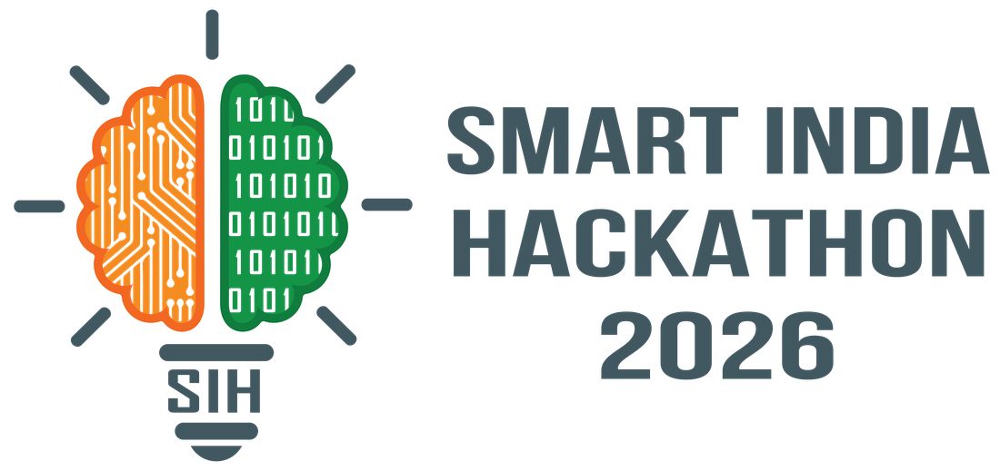

<div align="center">

<picture>
  <source media="(prefers-color-scheme: dark)" srcset="docs/assets/sih-2026-dark.png">
  
</picture>

<br><br>

# iTantra

**Indian Multilingual TTS &amp; STT Aided Neural Transceiver**<br>
*Radio Access for Low Bitrate Links*

Smart India Hackathon 2026 · Problem Statement **26173** · ISRO, Department of Space

<br>


<br>



</div>

<br>

> **Speech goes in one end. Speech comes out the other.** In between it becomes a few dozen
> bytes — small enough to cross a radio link that could never carry a voice.

Two people hold two ordinary phones. One speaks Tamil; the other hears Tamil. No SIM, no
tower, no cloud — the demo runs in aeroplane mode. What crosses the link is not audio. It
is meaning, and meaning is small.

## Why it works

| Representation | 3-second sentence | Fits a 300 bps link? |
| --- | --- | --- |
| Raw PCM, 16 kHz 16-bit mono | 96 000 B | No — 43 minutes |
| Opus at 6 kbps (the practical floor) | 2 250 B | No — 60 s |
| **iTantra, encrypted** | **52 B** | **Yes — 1.4 s** |
| **iTantra template code, encrypted** | **21 B** | **Yes — 0.6 s** |

Audio codecs compress the *waveform*, and a waveform detailed enough to be understood has
an irreducible size. iTantra doesn't compress the waveform at all — it recognises the
speech on the sending phone, sends the meaning, and re-synthesises it on the receiving
phone. Both people only ever speak and listen.

That is **1 600×** smaller than raw audio, and **43×** smaller than the Opus floor.


## What it does

- **Ten Indian languages** — English, Hindi, Bengali, Marathi, Telugu, Tamil, Gujarati,
  Kannada, Malayalam, Odia.
- **Entirely offline.** No cloud, no SIM, no network call at runtime.
- **One speaks, many hear.** Every frame is broadcast to the whole net, and a phone out of
  range is reached by a relay hop through one that isn't.
- **Cross-language alerts.** A Hindi speaker's alert reaches a Tamil speaker *in Tamil* —
  no translation model. It falls out of how the compression works.
- **Encrypted.** AES-256-GCM with a pre-shared key, so a fraudulent evacuation order can't
  be injected.
- **Two modes** — push-to-talk, and released for ordinary two-way conversation.
- **Four transports** behind one interface: Bluetooth Classic, BLE, Wi-Fi, and serial to a
  LoRa or HF radio for kilometre range.
- **Entry-tier hardware.** A 4 GB handset is the target, not a flagship.

## Status

The loop is closed and running on real handsets — speech in, radio link, speech out.

| | |
| --- | --- |
| Tasks complete | **126 of 170** ([docs/TODO.md](docs/TODO.md)) |
| Code | 156 source files, 76 test files, 8 modules |
| Last verified on | Galaxy **SM-S947B**, Android 16 |
| Latency target | 800–1200 ms end to end, push-to-talk |

## Build it

Needs JDK 17+, the Android SDK, and Python 3. Details in [docs/SETUP.md](docs/SETUP.md).

```bash
git clone https://github.com/vikranthsai310/sih2026.git
cd sih2026

./gradlew :core-proto:test                 # fast: pure JVM, no device, no models
./gradlew assembleDebug                    # build the APK

python tools/fetch_models.py --lang hi,en  # or --lang all
./gradlew installDebug
```

## Documentation

The design argument lives in [`docs/source/iTantra.html`](docs/source/iTantra.html) — read
that first for *why* the system is shaped this way. The `docs/` tree is the normative
spec: what to build, to what tolerance, and how it is verified.

| | |
| --- | --- |
| [docs/README.md](docs/README.md) | Index of the whole documentation set |
| [docs/ARCHITECTURE.md](docs/ARCHITECTURE.md) | Modules, threads, the full signal path |
| [docs/PROTOCOL.md](docs/PROTOCOL.md) | Frame format, script packing, template codes, AEAD, relaying |
| [docs/SECURITY.md](docs/SECURITY.md) | Threat model, provisioning, audit |
| [docs/EVALUATION.md](docs/EVALUATION.md) | How every published number is measured |
| [docs/iTantra Screens.html](docs/iTantra%20Screens.html) | All seventeen screens, openable in a browser |
| [docs/DEMO.md](docs/DEMO.md) | The seven-minute demonstration |
| [docs/TODO.md](docs/TODO.md) | **Start here to build.** Every task with a done-condition |

## Licence

Apache-2.0. No proprietary voice SDK anywhere in the system. Two dependencies carry
restrictive licences — espeak-ng (GPL-3.0) and Meta MMS (CC-BY-NC, non-commercial) — both
disclosed with their consequences in [LICENSES.md](LICENSES.md).

<div align="center">
<br>
<sub>Team <b>Taraketu</b> · Smart India Hackathon 2026 · Problem Statement 26173</sub>
</div>
